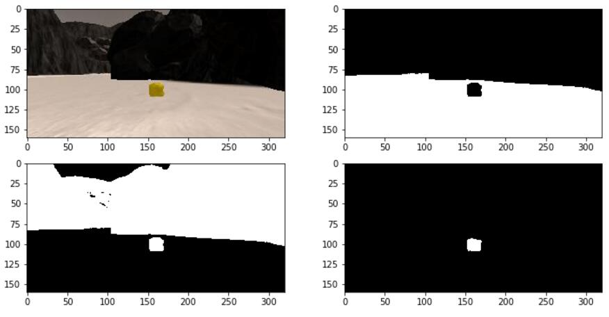
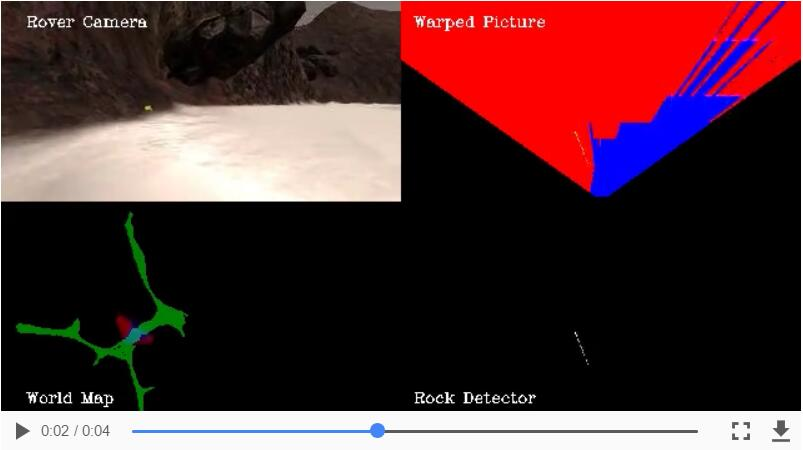
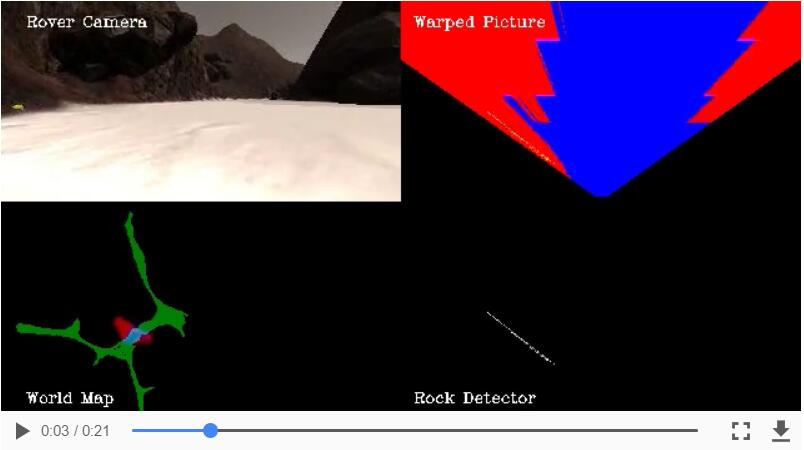
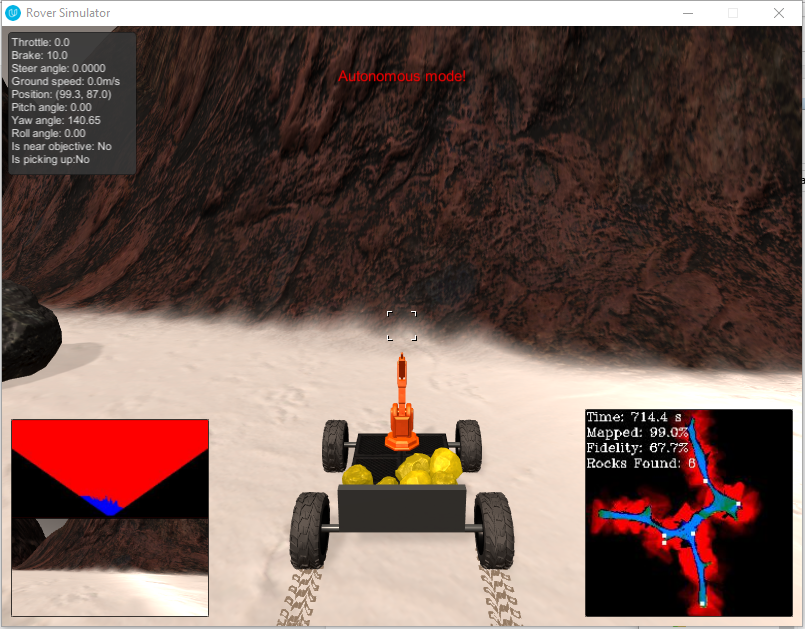

## Project: Search and Sample Return

**Note :** (Jupyter Notebook, `drive_rover.py`, `supporting_functions.py`, `decision.py` and `perception.py`) are in `./code` folder.  Test output video is in `./output` folder. The video for **Udacity Robotics Sample Return Challenge** can be found [here](Udacity Robotics Sample Return Challenge).

---


**The goals / steps of this project are the following:**  

**Training / Calibration**  

* Download the simulator and take data in "Training Mode"
* Test out the functions in the Jupyter Notebook provided
* Add functions to detect obstacles and samples of interest (golden rocks)
* Fill in the `process_image()` function with the appropriate image processing steps (perspective transform, color threshold etc.) to get from raw images to a map.  The `output_image` you create in this step should demonstrate that your mapping pipeline works.
* Use `moviepy` to process the images in your saved dataset with the `process_image()` function.  Include the video you produce as part of your submission.

**Autonomous Navigation / Mapping**

* Fill in the `perception_step()` function within the `perception.py` script with the appropriate image processing functions to create a map and update `Rover()` data (similar to what you did with `process_image()` in the notebook). 
* Fill in the `decision_step()` function within the `decision.py` script with conditional statements that take into consideration the outputs of the `perception_step()` in deciding how to issue throttle, brake and steering commands. 
* Iterate on your perception and decision function until your rover does a reasonable (need to define metric) job of navigating and mapping.  


## [Rubric](https://review.udacity.com/#!/rubrics/916/view) Points
### Here I will consider the rubric points individually and describe how I addressed each point in my implementation.  

---
### Writeup / README

#### 1. Provide a Writeup / README that includes all the rubric points and how you addressed each one.  You can submit your writeup as markdown or pdf.  

You're reading it!

### Notebook Analysis
#### 1. Run the functions provided in the notebook on test images (first with the test data provided, next on data you have recorded). Add/modify functions to allow for color selection of obstacles and rock samples.
To identify terrain, rocks and obstacles:

- The terrain area is gray white color, it should have higher RGB values. In addition, I selected the bottom half part of the image as ROI (region of interest) to identify terrain to avoid the sky disturbance. The default threshold [160, 160, 160] is used here.
- The rock samples are yellow color, and RGB yellow is [255, 255, 0]. Hence, these rocks should have higher R and G values, while B value is small.  Low threshold [100, 100, 0] and upper threshold [190, 190, 50] are used to isolate wall and terrain, respectively.
- The areas, which are not sky & terrain, are considered as obstacle. I selected the upper part of  the image as ROI to identify sky area with threshold ([70, 70, 70], [160, 160, 160]).

Open cv function `cv2.inRange()` is used to select the image part in range.

Here is an example of color selection results.



#### 2. Populate the `process_image()` function with the appropriate analysis steps to map pixels identifying navigable terrain, obstacles and rock samples into a worldmap.  Run `process_image()` on your test data using the `moviepy` functions provided to create video output of your result. 
I used R channel for storing obstacle info, G channel for storing rock info, and B channel for storing terrain info, respectively. , because it is rover centered coordinate in the warped picture. So I assigned 255 for that pix if its value is 1 (binary image) for each 3 channel.

With the function `pix_to_world()`, we can obtain world coordinates of  terrain, obstacle and rock for each image. I assigned `previous_value += 1` for each frame to update the world map.

Perspective transform is only valid when roll and pitch angles are near zero. So I added a mapping valid condition. The final code are:

```
roll_condition = [Rover.roll < 0.4, Rover.roll > 359.6]
pitch_condition = [Rover.pitch < 0.4, Rover.pitch > 359.6]
if any(roll_condition) and any(pitch_condition):
	Rover.worldmap[obstacle_y_world, obstacle_x_world, 0] += 1
    Rover.worldmap[rock_y_world, rock_x_world, 1] += 1
    Rover.worldmap[navigable_y_world, navigable_x_world, 2] += 1
```

Here is a video screenshot from the processed results of test dataset.



Here is a video screenshot from the processed results of recorded dataset.




### Autonomous Navigation and Mapping

#### 1. Fill in the `perception_step()` (at the bottom of the `perception.py` script) and `decision_step()` (in `decision.py`) functions in the autonomous mapping scripts and an explanation is provided in the writeup of how and why these functions were modified as they were.

`perception_step()` is same with the above `process_image()`  in addition to update distances and angles in polar coordinate for terrain, obstacle and rocks. `decision_step()` is the main problem for this project. 

The headache problem is the environment for rover exploring is unstructured. The rover often is stuck in stones and corners, and some rock samples are just scattered in various corners. To pick up all samples, the rover has to dive into these strange corners. Here is my method to solve these problem in `decision.py`.

- `left_side_mode()` is designed to drive the rover moving along with the left wall during exploration. I set several pix counters for 6 region (small, middle and large in front of rover) on the warped obstacle image (3 in each side). If there is no obstacle in these area in front of rover, corresponding steer angle would given. The left side has high priority to guarantee the rover moving along the left wall.

- `return_start_point()` is used for backing home once all samples are collected. Its method is that: 

  1) If the rover head does not toward to the start point, rotate it; 

  2) Calculate the heading error in real time with `calculate_angle_error()`, calculate 30% and 70% larger navigable angle as low and upper boundary, use `np.clip(angle_error, nav_angle_low, nav_angle_upper)` to generate steer angle.  

  3) Add `stuck_mode()` to avoid stuck conditions. This function is a series of actions with stuck time increasing. Briefly, double throttle --> max throttle --> (turn right and max throttle) x2--> move back with left steer.

- `stop_mode()` controls the rover rotate until there sufficient navigable terrain in front of it.

- `pickup_mode()` executes pick up action. Control the rover to close the sample with lower speed once the rock is detected, then pick up rock if near rock.

-  `decision_step()` integrates the above functions, it makes strategy to drive the rover following different modes. 


#### 2. Launching in autonomous mode your rover can navigate and map autonomously.  Explain your results and how you might improve them in your writeup.  

**Note: Resolution: 800x600, Graphics quality: Fantastic, FPS is about 50.**

My rover map 99% of the environment with 67.7% fidelity against the ground truth within 12 min. It finds all the six rock samples and then automatically back home position. The final screenshot likes following picture, and the video can be found [here](https://youtu.be/SUSzm_10sPE).

As for the further improvements, there are so many to say. List a few:

- Move faster if the rover in an open terrain area.
- Do not move into places have been visited.
- Limit the steer rate to achieve smoother movement. It can improve the mapping accuracy as well.
- More clever to determine suitable action for unstuck. (It tried in order in my version)
- Obstacle mapping seems not correct. The altitude of these mountains are considered as a large area. Map the obstacle as a thin line would be better.



