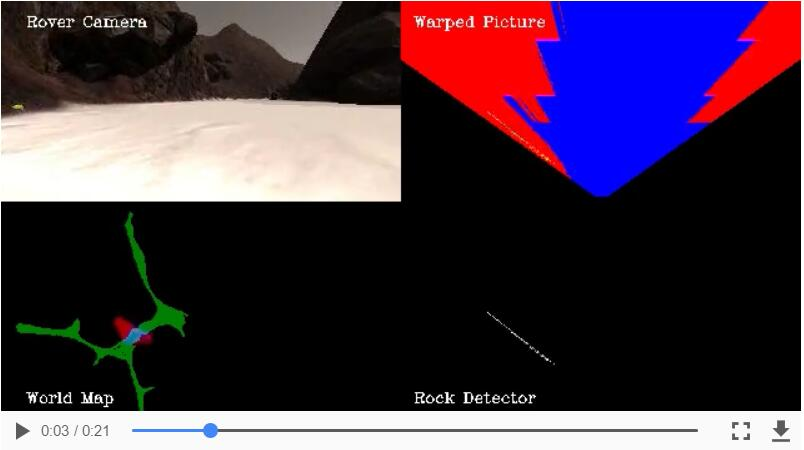

## Project: Search and Sample Return
---


**The goals / steps of this project are the following:**  

**Training / Calibration**  

* Download the simulator and take data in "Training Mode"
* Test out the functions in the Jupyter Notebook provided
* Add functions to detect obstacles and samples of interest (golden rocks)
* Fill in the `process_image()` function with the appropriate image processing steps (perspective transform, color threshold etc.) to get from raw images to a map.  The `output_image` you create in this step should demonstrate that your mapping pipeline works.
* Use `moviepy` to process the images in your saved dataset with the `process_image()` function.  Include the video you produce as part of your submission.

**Autonomous Navigation / Mapping**

* Fill in the `perception_step()` function within the `perception.py` script with the appropriate image processing functions to create a map and update `Rover()` data (similar to what you did with `process_image()` in the notebook). 
* Fill in the `decision_step()` function within the `decision.py` script with conditional statements that take into consideration the outputs of the `perception_step()` in deciding how to issue throttle, brake and steering commands. 
* Iterate on your perception and decision function until your rover does a reasonable (need to define metric) job of navigating and mapping.  

[//]: # "Image References"

[image1]: ./misc/threshed_pic.jpg
[image2]: ./misc/test_output.jpg
[image3]: ./misc/recorded_output.jpg
[image4]: ./calibration_images/example_rock1.jpg

## [Rubric](https://review.udacity.com/#!/rubrics/916/view) Points
### Here I will consider the rubric points individually and describe how I addressed each point in my implementation.  

---
### Writeup / README

#### 1. Provide a Writeup / README that includes all the rubric points and how you addressed each one.  You can submit your writeup as markdown or pdf.  

You're reading it!

### Notebook Analysis
#### 1. Run the functions provided in the notebook on test images (first with the test data provided, next on data you have recorded). Add/modify functions to allow for color selection of obstacles and rock samples.
To identify terrain, rocks and obstacles:

- The terrain area is gray white color, it should have higher RGB values. In addition, I selected the bottom half part of the image as ROI (region of interest) to identify terrain to avoid the sky disturbance. The default threshold [160, 160, 160] is used here.
- The rock samples are yellow color, and RGB yellow is [255, 255, 0]. Hence, these rocks should have higher R and G values, while B value is small.  Low threshold [100, 100, 0] and upper threshold [190, 190, 50] are used to isolate wall and terrain, respectively.
- The areas, which are not sky & terrain, are considered as obstacle. I selected the upper part of  the image as ROI to identify sky area with threshold ([70, 70, 70], [160, 160, 160]).

Open cv function `img_select = cv2.inRange(img, low_threshold, high_threshold)` is used to select the image part in range.

Here is an example of color selection results.

![alt text][image1]

#### 2. Populate the `process_image()` function with the appropriate analysis steps to map pixels identifying navigable terrain, obstacles and rock samples into a worldmap.  Run `process_image()` on your test data using the `moviepy` functions provided to create video output of your result. 
I used R channel for storing obstacle info, G channel for storing rock info, and B channel for storing terrain info, respectively. , because it is rover centered coordinate in the warped picture. So I assigned 255 for that pix if its value is 1 (binary image) for each 3 channel.

With the function `pix_to_world`, we can obtain world coordinates of  terrain, obstacle and rock for each image. I assigned `previous_value += 1` for each frame to update the world map.

Perspective transform is only valid when roll and pitch angles are near zero. So I added a mapping valid condition. The final code are:

```
roll_condition = [Rover.roll < 0.4, Rover.roll > 359.6]
pitch_condition = [Rover.pitch < 0.4, Rover.pitch > 359.6]
if any(roll_condition) and any(pitch_condition):
	Rover.worldmap[obstacle_y_world, obstacle_x_world, 0] += 1
    Rover.worldmap[rock_y_world, rock_x_world, 1] += 1
    Rover.worldmap[navigable_y_world, navigable_x_world, 2] += 1
```

Here is a video screenshot from the processed results of test dataset.


Here is a video screenshot from the processed results of recorded dataset.




### Autonomous Navigation and Mapping

#### 1. Fill in the `perception_step()` (at the bottom of the `perception.py` script) and `decision_step()` (in `decision.py`) functions in the autonomous mapping scripts and an explanation is provided in the writeup of how and why these functions were modified as they were.


#### 2. Launching in autonomous mode your rover can navigate and map autonomously.  Explain your results and how you might improve them in your writeup.  

**Note: Resolution: 800x600, Graphics quality: Fantastic, FPS is about 50.**

Here I'll talk about the approach I took, what techniques I used, what worked and why, where the pipeline might fail and how I might improve it if I were going to pursue this project further.  


![alt text][image3]


